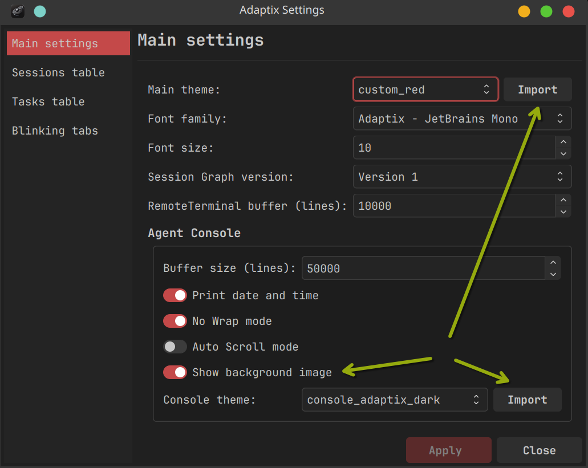
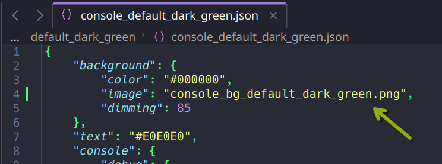

# AdaptixClient-themes

Custom themes for the app and console must be imported through the settings panel. The files will be automatically copied to the `~/.adaptix/themes/app/` and `~/.adaptix/themes/console/` directories.

Specify the path to the console background image in the console theme configuration file.

It's best to place the image in the same directory as the console theme configuration file (`~/.adaptix/themes/console/`).
