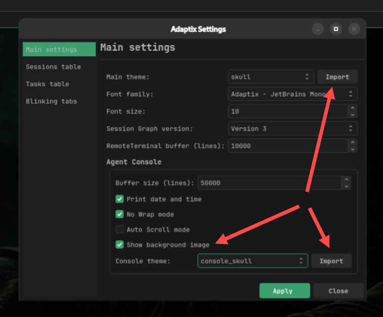
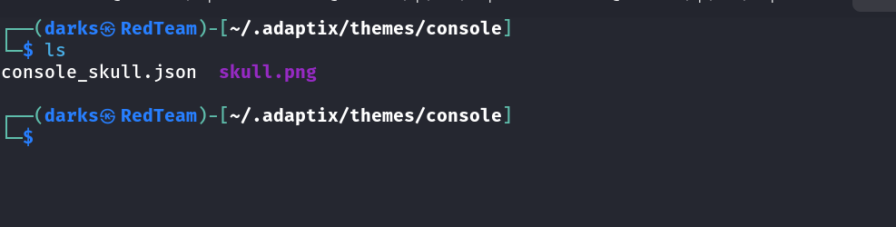
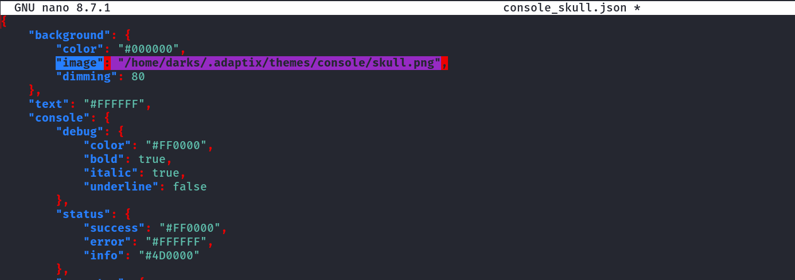
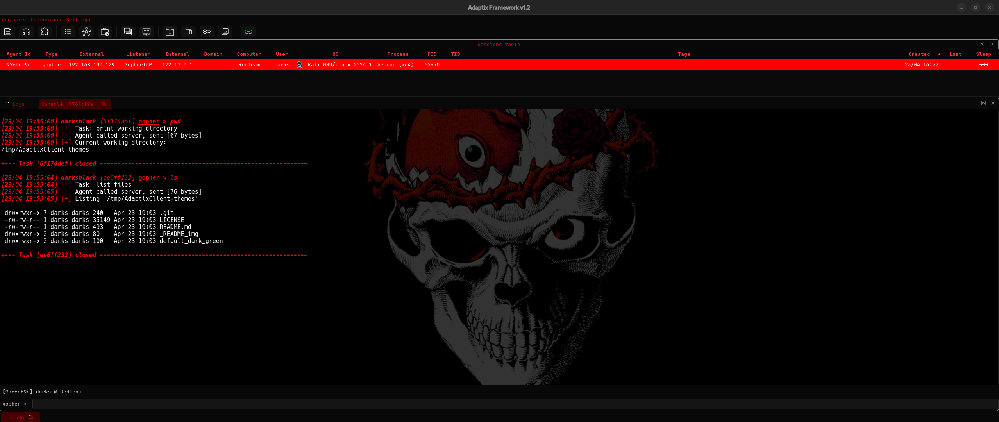

# AdaptixClient-themes SKULL

Custom themes for the app and console must be imported through the settings panel. The files will be automatically copied to the `~/.adaptix/themes/app/` and `~/.adaptix/themes/console/` directories.

Copy the `skull.png` image to the `~/.adaptix/themes/console/` directory.

Specify the path to the console background image in the console theme configuration file. (Specify the absolute path.)

Quick preview of the theme.

